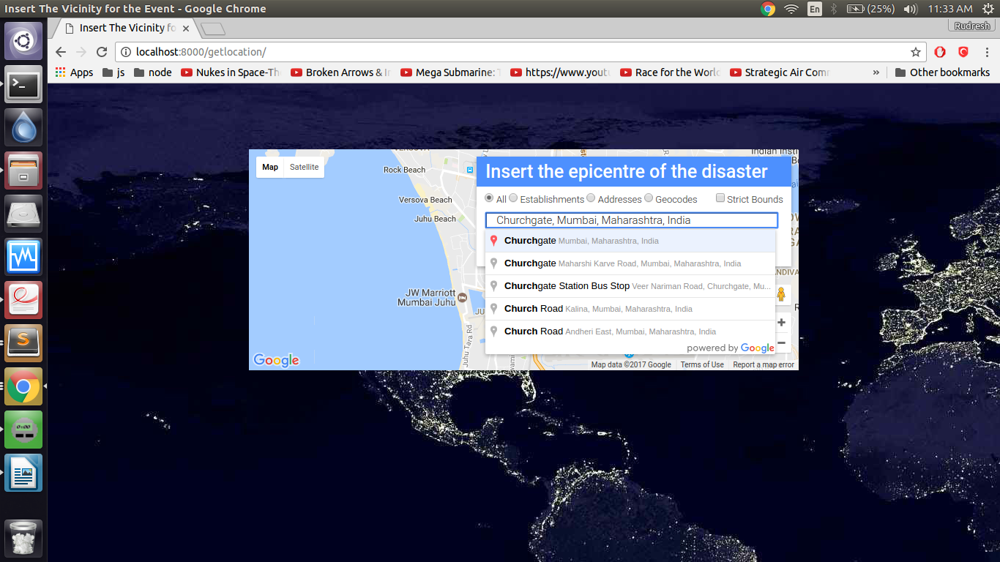
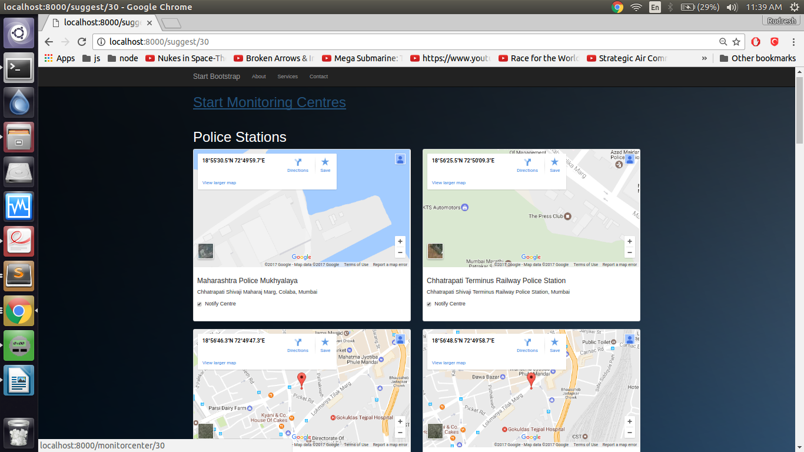
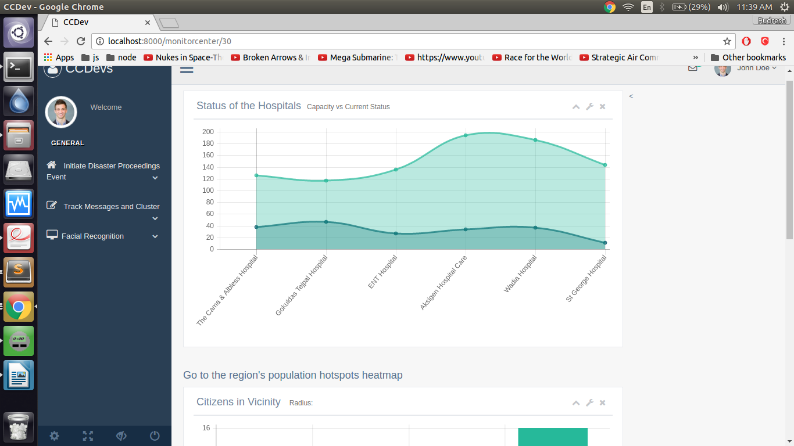
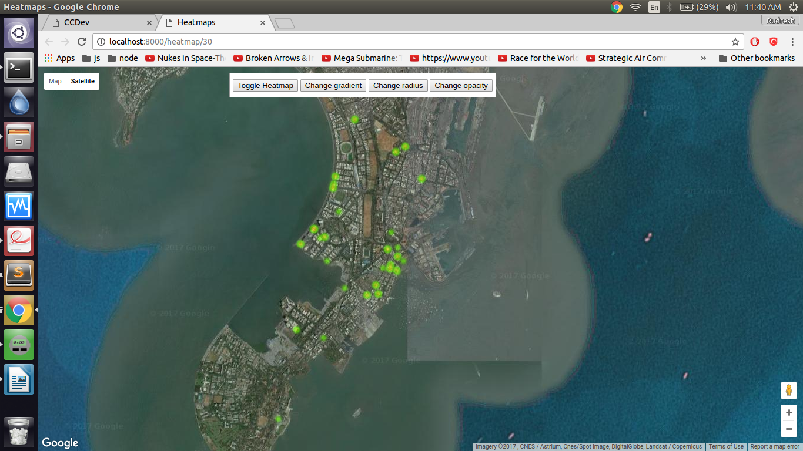
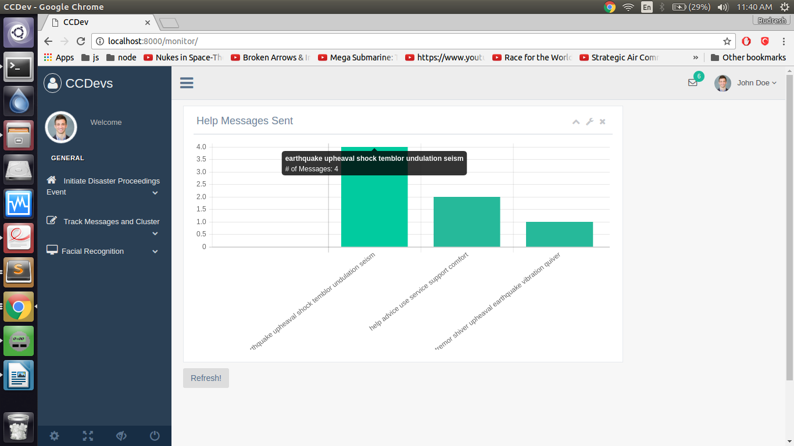
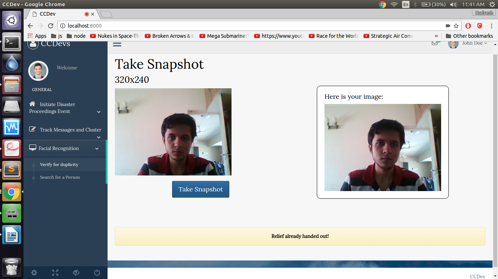

# disaster-management

A disaster management app we built for Codeshastra 2017. 

This WebApp won the First Prize at the same.

## Features

-Remote monitoring of disaster and relief response.

-Automated suggestions of healthcare centres/police stations to triage relief from.

-SMS alerts to victims in the area with directions to the nearest relief centre.

-Monitoring of hospitals in the area.

-Hospitals can update patient information merely by sending a simple SMS in case of communications loss.

-Heatmap generation with the location of victims in the region to direct response.

-Citizens in case of a disaster can send SMS's to the authority. This SMS stream will be monitored and keyword clustering will be carried out to initiate a response. 

-Facial recognition to hand out relief. Photos of victims to be taken at the centre. Facial recognition will determine if relief has already been handed out to a particular individual at the centre.

-The families can search for their relatives by merely uploading their photos.

-Twitter Stream data analysis to coordinate response and relief.

##Screenshots

###Initiate Disaster

###Place Suggestion

###Hospital Monitoring

###Heatmap

###SMS Stream clustering/analysis

###Facial Recognition for relief

